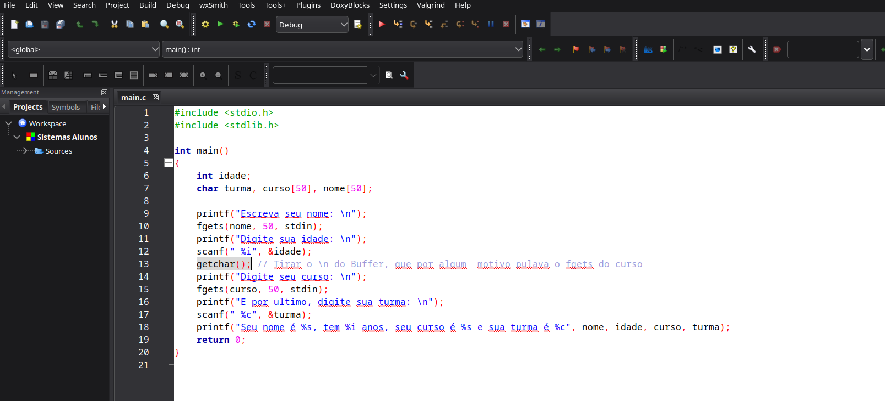

# Sistema cadastro alunos
Pequeno projeto, que tive como inspiração nas aulas da disciplina do meu curso dee Ciências da Computação, Introdução à Programação de Computadores
 
Utilizei a IDE Code Blocks, programando em C
 

